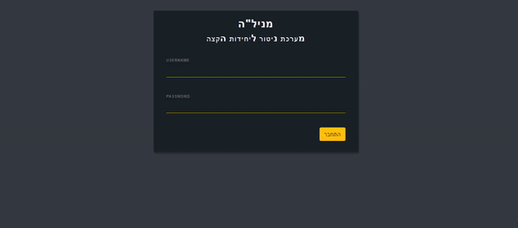
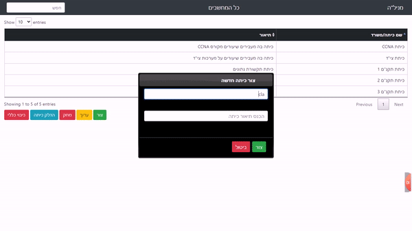
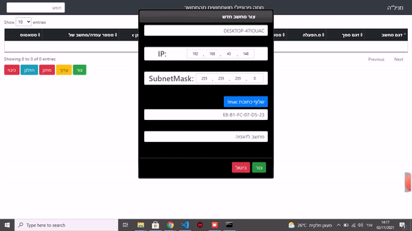

# Welcome to Manila!
Manila is an *organizational system* for monitoring and controlling endpoints. The system allows an admin to control and monitor domains in real-time, using different network protocols.

## System options:
* Turn on remote computers - using **WakeOnLan**.
* Collect information from remote computer - mac address, serialNumber, pc model using **WMIC Tool**.
* Delete users profiles - using **[`powershell script`](deleteUsers/deleteUsers.ps1)**.
* Show Real-Time Endpoints Connection - running background **[`pinger`](pinger.js)**.
* Real-Time updates - using **[`WebSocket`](socket.js)** protocol
## Usage:
# [`The Server`](server.js):
```javascript
cd manila
npm install
npm start
```

# [`Create or Delete users`](createOrDeleteUser.js):
```javascript
cd manila
npm install
npm run createOrDelUser
```
## pages:
### [`sign in page`](pages\signin.html):

### [`classes page`](pages\index.html):

### [`computers page`](pages\computers.html):

